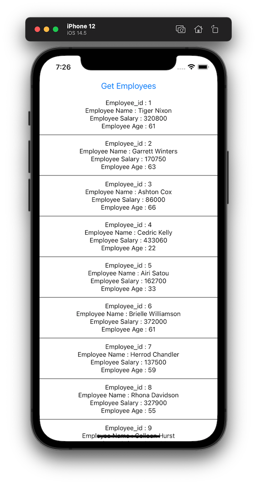

# rtk-createapi

*Readme last updated July 7th, 2022*

A React Native Typescript app that explores using `createApi` from the [Redux Toolkit](https://redux-toolkit.js.org) (RTK). It's an "evolutionary" step from exploration of using `createAsyncThunk` in my [rtk-createasyncthunk](https://github.com/jkoutavas/rtk-createasyncthunk) repository. 

You can read about `createApi` in redux-toolkit's [RTK Query Overview](https://redux-toolkit.js.org/rtk-query/overview) article.

This repo has proven to run on node v14.17.3, Cocopods v1.11.2, and Xcode 13.2

After cloning this repo, do the following to see the app in action:

```
$ cd {clone-repo}/createApiApp
$ yarn install
$ cd ios
$ pod install
$ cd ..
$ npx react-native run-ios

```

Then press the "Get Employees" button and you'll see this displayed:



## How this app was generated

(You don't need to execute these steps)

```
$ npx react-native init createApiApp --template react-native-template-typescript
$ yarn add @reduxjs/toolkit react-redux
$ yarn add @types/react-redux --dev
```
